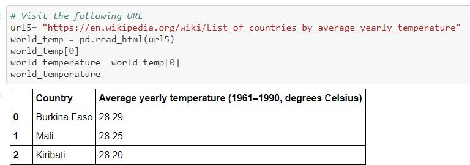
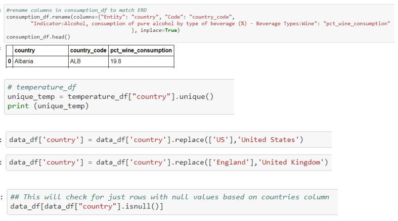
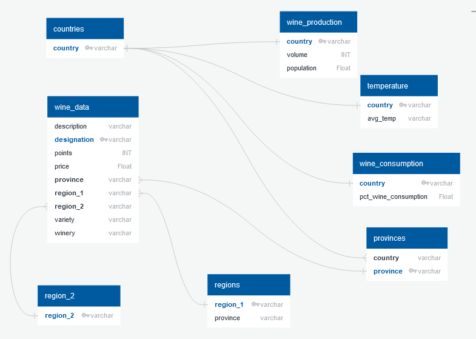

# Happy Hour
## ETL Group Project
By:
Bill Roll
Jessi Volosin
Joseph Atemkuh
Kasey Lancerda
Kinnari Patel

Members: Kasey Lacerda, Kinnari Patel, Jessi Volosin, Bill Roll, and Joe Atemkuh

Wine time! If you want to know all about wine, you've come to the right place! For our project we have gathered 
different data sources about wine that includes information like the vineyard it comes from, country, consumption, 
production, temperature and more!

## Table of contents
* [Assignment](#assignment)
* [Data Sources](#data_sources)
* [Process](#process)
* [Database Steps](#database_steps)
* [Example Queries](#example_queries)

## Assignment
The IMDB of Wine will allow users to gather interesting data on various wines from around the world, including 
countries of origin and weather. To accomplish this, we sought out data from different sources and combined them 
using extract, data and load (ETL) procedures for a clean and efficient databae.  

## Data Sources

Our data sources can be found in the Resources folder, here:  https://github.com/jvolosin/etl-project/tree/main/Resources 

### Wine Data
  
Filename: wine-data.csv
Data Source: Kaggle (csv file)
- URL: https://www.kaggle.com/zynicide/wine-reviews?select=winemag-data_first150k.csv
- Data was scraped from WineEnthusiast (https://www.winemag.com/?s=&drink_type=wine) as of 06/15/2017
- Date Accessed: 11/24/2020

The data set consists of 11 fields:
- Unique Primary ID
- Country: the country that the wine is from
- Description: a few sentences from a sommelier describing the wine's taste, smell, look, feel, etc.
- Designation: the vineyard within the winery where the grapes that made the wine are from 
- Points: the number of points WineEnthusiast rated the wine on a scale of 1-100
- Price: the cost for a bottle of the wine
- Province: the province or state that the wine is from
- Region 1: the wine growing area in a province or state
- Region 2: sometimes there are more specific regions specified within a wine growing area (ie Rutherford 
	inside the Napa Valley), but this value can sometimes be blank
- Variety: the type of grapes used to make the wine
- Winery: the winery that made the wine
		
### Wine Consumption

Filename: wine-consumption.csv
Data Source: Our World in Data (csv file)
- URL: https://ourworldindata.org/grapher/wine-as-share-alcohol-consumption
- Data is from the World Health Organization Global Health Observatory (GHO)
- Time Period: 2010
- Date Accessed: 12/01/2020

The data set consists of 3 fields:
- Entity: the country where the consumption data is from
- Code: country ID
- Indicator: Alcohol, consumption of pure alcohol by type of beverage (%) - Beverage Types:Wine
	This field represents the percentage of total alchohol consumed that is wine, as opposed to 
	other types of alcohol.

### Wine Production
Filename: wine-production.csv
Data Source: World Population Review (csv file)
- URL: https://worldpopulationreview.com/country-rankings/wine-producing-countries
- Data is from WorldAtlas
- Time Period: 2020
- Data Accessed: 12/01/2020

The data set consists of 3 fields:
- Country: the country where the production data is from
- wineProduction: wine production in liters
- wineProductionGallons: wine production in gallons
- Pop2020: 2020 population

### Wine Temperature  
Filename: wine_temperature.csv
Data Source: Wikipedia (web scraping)
- URL: https://en.wikipedia.org/wiki/List_of_countries_by_average_yearly_temperature
- Data is from Lebanese Economy Forum: https://web.archive.org/web/20150905135247/http://lebanese-economy-forum.com/wdi-gdf-advanced-data-display/show/EN-CLC-AVRT-C/
- Data Time Period: 1961 - 1990
- Data Accessed: 12/03/2020

The data set consists of two columns:
- Country: the country where the temperature data is from.
- Average Yearly Temperature   

## Process
  
### Extract

Our process consisted of first browsing the web for data. We looked for different types of sources that were available as csvs to 
download, JSONs, APIs, or web scraping options. We considered using a weather API and a an beverage API. However, the beverage API 
was non-standard and the API had download limitations which would have hindered the data gathering process. We considered a few 
different web scraping options, including data on wine storage properties, and wine and cheese pairings. However, we found that 
these datasets were limited in size and did not provide usefulness to our overall dataset. We decided to scrape temperatures from 
countries around the world to gain weather insight into wine-producing regions, and to combine this with the csv data files above 
to create our raw dataset. To view the full code used for web scraping see temperature_web_scraping jupyter notebook at:
https://github.com/jvolosin/etl-project/temperature_web_scraping.ipynb.

### Transform
  
We then converted the web scraping data into csvs in jupyter notebook and design an entity relationship diagram (ERD) to most 
efficiently organize our data. We imported all the csvs into pandas as shown in our clean_transform jupyter notebook.  We compiled 
a common list of countries from all of our sources, as country was the primary key for several tables. We selected desired columns 
from the dataset, which included the following: 

* from wine-data: Unique Primary ID (i.e. wine_id), Country, Description, Designation, Points, Price, Province, Region_1, Region_2,
	Variety, and Winery 
* from wine-consumption: Entity (i.e. country), and Indicator (i.e. pct_wine_consumption)
* from wine-production: Country, wineProduction (i.e. volume, in liters), and Pop2020 (i.e. population, in 1000s)
* from world_temperature: all fields, including Country and Average Yearly Temperature (i.e. avg_temp)

We checked for duplicate values, records requiring renaming for consistency (e.g countries), dropped rows with irrelevant 
information and renamed columns to make more sense. We then exported the data into csvs that would be used to populate the database. 
To view the full code used for data cleaning and transformation, see Final_tables jupyter notebook, here: https://github.com/jvolosin/etl-project/clean_transform.ipynb.

### Load
       
We exported our ERD to a sql file and formatted it into a create table query to be used in postgresql. We selected postgresql 
because the type of data fit well with SQL format and it can be easily manipulated by the user with simple queries. Advantages of 
this format include that is is open source, largely compliant with SQL standard, and maintains good language support for Python, 
Java, C++ and more. We created a database, and once the tables were successfully created, we imported the data. Due to foreign keys, 
the tables had to be imported in a specific order as shown in Database Steps below.

## Database Steps

The steps to create and execute the IMDB of Wine database are below:

1. Python Dependencies: 

from splinter import Browser
from bs4 import BeautifulSoup
import pandas as pd
import numpy as np
import time
from selenium import webdriver
from webdriver_manager.chrome import ChromeDriverManager

2. Database configuration: See ERD diagram
3. Is Chrome needed? Yes
4. What files to run in what order:

temperature_web_scraping.ipynb
clean_transform.ipynb
open pgAdmin4
create database
run create table schema: https://github.com/jvolosin/etl-project/tree/main/Queries/create_tables_etl.sql

File Import Order:
1. countries.csv
2. wine_consumption.csv
3. wine_production.csv
4. provinces.csv
5. regions.csv
6. region_2.csv
7. wine_data.csv
8. temperature.csv

       
## Example Queries

See example queries txt file Example_Queries.txt at: 
https://github.com/jvolosin/etl-project/tree/main/Queries/Example_Queries.txt 
  
   
           
