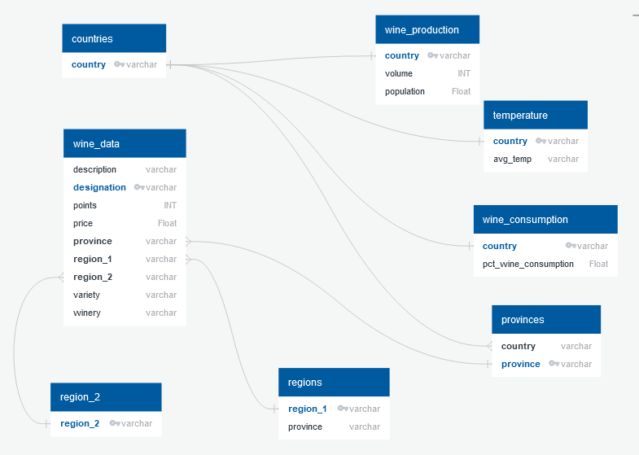

# Happy Hour
## ETL Group Project

Members: Kasey Lacerda, Kinnari Patel, Jessi Volosin, Bill Roll, and Joe Atemkuh

Wine time! If you want to know all about wine, you've come to the right place! For our project we have gathered different data sources about wine that includes information like the vineyard it comes from, country, consumption, production, temperature and more!

## Table of contents
* [Assignment](#assignment)
* [Data Sources](#data_sources)
* [Process](#process)
* [Database Steps](#database_steps)
* [Example Queries](#example_queries)

## Assignment
This project will demonstrate the ability to gather data, manipulate it, and organize it in into a database. This project does **not** include any data analysis. The purpose of this project is to create a well ordered, useful database that could be utilized by an organization. Databases resulting from ETL are often the starting point for an organization's data analysis.

## Data Sources

### Wine Data  

	• Data Source: Kaggle (csv file)  
		○ URL: https://www.kaggle.com/zynicide/wine-reviews?select=winemag-data_first150k.csv  
		○ Data was scraped from WineEnthusiast (https://www.winemag.com/?s=&drink_type=wine) as of 06/15/2017.  
		○ Date Accessed: 11/24/2020  
	• The data set consists of 10 fields:  
		○ Unique Primary ID  
		○ Country: the country that the wine is from  
		○ Description: a few sentences from a sommelier describing the wine's taste, smell, look, feel, etc.  
		○ Designation: the vineyard within the winery where the grapes that made the wine are from  
		○ Points: the number of points WineEnthusiast rated the wine on a scale of 1-100  
		○ Price: the cost for a bottle of the wine  
		○ Province: the province or state that the wine is from  
		○ Region 1: the wine growing area in a province or state  
		○ Region 2: sometimes there are more specific regions specified within a wine growing area (ie Rutherford inside the Napa Valley), but this value can sometimes be blank  
		○ Title: the title of the wine review, which often contains the vintage if you're interested in extracting that feature  
		○ Variety: the type of grapes used to make the wine  
		○ Winery: the winery that made the wine    
		

### Wine Consumption     
	• Data Source: Our World in Data (csv file)      
		○ URL: https://ourworldindata.org/grapher/wine-as-share-alcohol-consumption      
		○ Data is from the World Health Organization Global Health Observatory (GHO)      
		○ Time Period: 2010      
		○ Date Accessed: 12/01/2020      
	• The data set consists of 3 fields:      
		○ Entity: the country where the consumption data is from    
		○ Code: country ID    
		○ Indicator:Alcohol, consumption of pure alcohol by type of beverage (%) - Beverage Types:Wine: % of wine consumption    
			§ Recorded alcohol per capita (15+) consumption of pure alcohol is calculated as the sum of beverage-specific alcohol consumption of pure alcohol (beer, wine, spirits, other) from different sources.    
			§ Definition
				□ Recorded APC is defined as the recorded amount of alcohol consumed per capita (15+ years) over a calendar year in a country, in litres of pure alcohol. The indicator only takes into account the consumption which is recorded from production, import, export, and sales data often via taxation. Numerator: The amount of recorded alcohol consumed per capita (15+ years) during a calendar year, in litres of pure alcohol. Denominator: Midyear resident population (15+ years) for the same calendar year, UN World Population Prospects, medium variant.    

### Wine Production  
	• Data Source: World Population Review (csv file)  
		○ URL: https://worldpopulationreview.com/country-rankings/wine-producing-countries   
		○ Data is from WorldAtlas  
		○ Time Period: 2020  
		○ Data Accessed: 12/01/2020  
	• The data set consists of 3 fields:  
		○ Country: the country where the production data is from  
		○ wineProduction: wine production in liters  
		○ wineProductionGallons: wine production in gallons  
		○ Pop2020: 2020 population  

### Wine Temperature  
	• Data Source: Wikipedia (web scraping)  
		○ URL: https://en.wikipedia.org/wiki/List_of_countries_by_average_yearly_temperature  
		○ Data is from Lebanese Economy Forum: https://web.archive.org/web/20150905135247/http://lebanese-economy-forum.com/wdi-gdf-advanced-data-display/show/EN-CLC-AVRT-C/  
		○ Time Period: 1961 - 1990  
		○ Data Accessed: 12/03/2020  
	• The data set consists of two columns:  
		○ Country: the country where the temperature data is from.  
		○ Avg_temp: average yearly temperature  
			§ Climate: Average yearly temperature is calculated by averaging the minimum and maximum daily temperatures in the country, averaged for the years 1961-1990, based on gridded climatologies from the Climatic Research Unit.  

## Process  
   ### Extract  

        Our process consisted of first browsing the web for data. We looked for different types of sources that were either csvs to download, JSONs, APIs, or web scraping options. We considered using a weather API and a wine API. We also considered using a few different web scraping options. In the end we used csvs and web scraping for our data sources (listed above).  
        To view the full code used for extraction see Country_temperature jupyter notebook.  
  

   ### Transform  
  
        We then converted the web scraping data into csvs in jupyter notebook.      
        After we had all of our sources available for the project we put together our ERG to see the possible connections and overlap between our different data sources.   
        Our next step was to import our data into our "Clean Up" jupyter notebook. After we had all of our data as dataframes the clean up process began.  We checked for duplicate information, dropped rows with irrelevant information and renamed columns to make more sense. To view the full code used for the transformation see Final_tables jupyter notebook.  

   
          
  
   ### Load  
       
       We exported our ERG to pgAdmin. Once all of our data was cleaned up we imported it into pgAdmin.  
       We decided to use pgAdmin because of the advantages it provides for potential consumers of the data.  
       These advantages include open source, largely compliant with SQL standard, good language support for Python, Java, C++ and more.   
         

  

## Database Steps  
        • Dependencies: from splinter import Browser  
                        from bs4 import BeautifulSoup  
                        import pandas as pd  
                        import numpy as np  
                        import time  
                        from selenium import webdriver  
                        from webdriver_manager.chrome import ChromeDriverManager  
        • Configurations:  
        • Is Chrome needed? Yes
        • What files to run in what order: 
       

## Example Queries  
  

   
           
